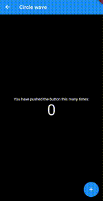
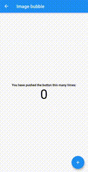
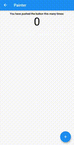
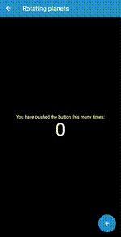
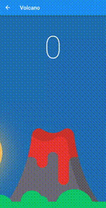
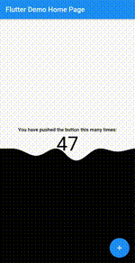
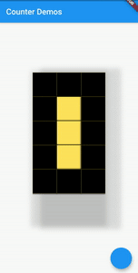
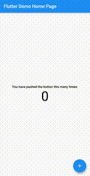

# animated_counter
-------------------------------------------------------------

A collection of animated counters sourced during the FlutterCounterChallenge2020.

Block                      | Circle Wave               |        Creatures
:-------------------------:|:-------------------------:|:-------------------------:
    |  |  

Image Bubble               |Particles                  |        Portrait
:-------------------------:|:-------------------------:|:-------------------------:
   |      |  

Rotating Bubbles           |        Rotating Planets   |        Volcano
:-------------------------:|:-------------------------:|:-------------------------:
 |  |  

Wave                       |        Pixel             |        Disks
:-------------------------:|:-------------------------:|:-------------------------:
         |           |  


## Features

* Beautiful Smooth Animations
* Ability to increment, decrement and get current counter value.
* One stop destination for FlutterCounterChallenge2020 widgets.
* Completely open source.

## Supported platforms

* Flutter Android
* Flutter iOS
* Flutter web
* Flutter desktop

## Live preview

http://ryuukenshi.github.io/animated_counter

Note: This page is built with flutter-web, hence the animations may not be smooth. For a better user experience, please run the example app on a mobile device.

## Installation

Add `animated_counter: 1.0.0` to your `pubspec.yaml` dependencies. And import it:

```dart
import 'package:collapsible_sidebar/collapsible_sidebar.dart';
```

## How to use
-----------------------------------------------

First create the object of the Animated Counter you wish to use. Then use its `build()` method to build it. Finally use the `incrementCounter()`, `decrementCounter()` and `getCounter()` methods to control the widget animations.

### Create the object of the animated counter you like

```dart
  BlocksCounter block = BlocksCounter(initialCounter: 0);
  DisksCounter disk = DisksCounter(initialCounter: 0);
  WaveCounter wave = WaveCounter(initialCounter: 0);
  CircleWaveCounter circle;
  RotatingBubblesCounter bub = RotatingBubblesCounter(initialCounter: 0, initialColors: [Colors.red, Colors.green, Colors.blue]);
  RotatingPlanetsCounter plan = RotatingPlanetsCounter(initialCounter: 0, initialColors: [Colors.red, Colors.green, Colors.blue]);
  CreatureCounter cre;
  ImageBubbleCounter imgbub = ImageBubbleCounter(initialCounter: 0, image: 'assets/dash.jpg');
  PortraitCounter por = PortraitCounter(initialCounter: 0, image: 'assets/mattis.jpeg');
  ParticlesCounter part;
  VolcanoCounter vol = VolcanoCounter(initialCounter: 0, enableSky: true);
  PixelCounter pix = PixelCounter(initialCounter: 0);

  @override
    void initState() {
      circle = CircleWaveCounter(vs: this, initialCounter: 0, initialColors: [Colors.red, Colors.green, Colors.blue]);
      cre = CreatureCounter(vs: this, initialCounter: 0, initialColors: [Colors.red, Colors.green, Colors.blue]);
      part = ParticlesCounter(initialCounter: 0, images: getAssetName());
      super.initState();
    }
```

### Use it in widget tree using `build()` method. Control it using the `incrementCounter()`, `decrementCounter()` and `getCounter()` methods.

```dart
@override
  Widget build(BuildContext context) {
    return Scaffold(
      body: PageView(
        children: [
          block.build(context),
          disk.build(context),
          wave.build(context),
          circle.build(context),
          bub.build(context),
          plan.build(context),
          cre.build(context),
          imgbub.build(context),
          por.build(context),
          part.build(context),
          vol.build(context),
          pix.build(context),
        ],
      ),
      floatingActionButton: FloatingActionButton(
        onPressed: (){
          setState(() {
            block.incrementCounter();
            disk.incrementCounter();
            wave.incrementCounter();
            circle.incrementCounter();
            bub.incrementCounter();
            plan.incrementCounter();
            cre.incrementCounter();
            imgbub.incrementCounter();
            por.incrementCounter();
            part.incrementCounter();
            vol.incrementCounter();
            pix.incrementCounter();
          });
        },
      ),
    );
  }
```

## License
--------------------------------------------------------------

Apache 2.0